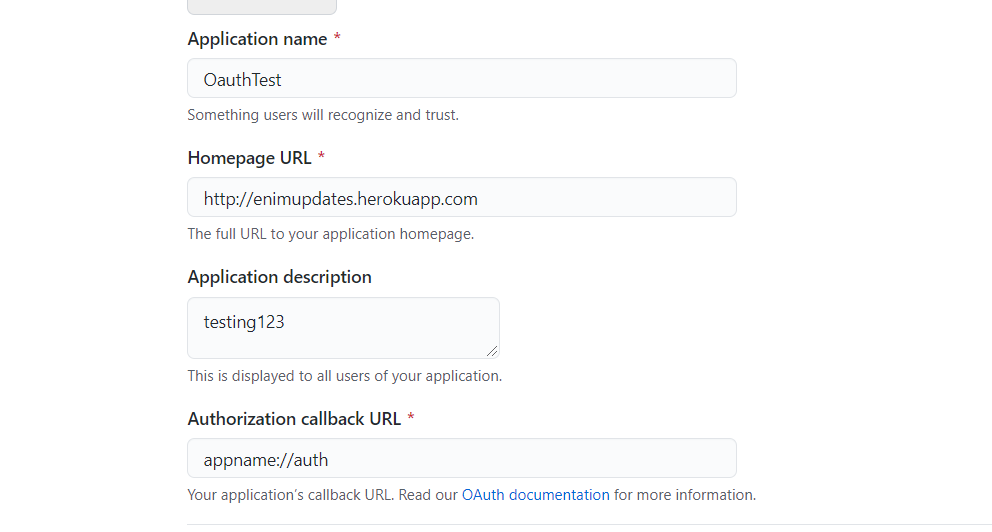

# github_auth_app

## AndroidManifest.xml

check [here](./android/app/src/main/AndroidManifest.xml)

```xml
<intent-filter android:label="simple_auth">
  <action android:name="android.intent.action.VIEW" />
  <category android:name="android.intent.category.DEFAULT" />
  <category android:name="android.intent.category.BROWSABLE" />
  <!-- <data android:scheme="com.example.github_auth_app" /> -->
  <data
    android:host="auth"
    android:scheme="appname" />
</intent-filter>
```

## Callback URL



## Extract Token

```dart
void login(simpleAuth.AuthenticatedApi api) async {
  try {
    var success = await api.authenticate();
    print(success.toJson());
    //extract token from json, save it to flutter secure storage
    //save that user is logged in to a hive database
    showMessage("Logged in success: $success");
  } catch (e) {
    showError(e);
  }
}
```